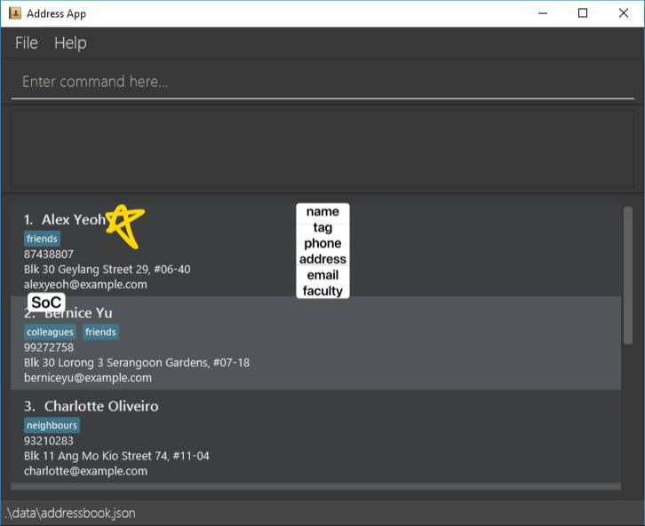

# CampusBook

* This is **a project for university students** to easily find and access contact information of professors and administrative staff.  
  Example usages:
  * as a centralized platform for searching professors’ contact details
  * as a quick reference for administrative staff information (e.g., faculty office, finance office, IT support)
* The project simulates a real-world software system for a desktop application (called _CampusBook_) used for managing and searching university contacts.
  * It is **written in OOP fashion**. It provides a **well-structured** code base (~6 KLoC) that students can extend, without being overwhelmingly big.
  * It comes with **comprehensive user and developer documentation**.
* It is named `CampusBook` because it extends the AddressBook concept but adapted for a university context.
* For the detailed documentation of this project, see the **[CampusBook Product Website](https://AY2526S1-CS2103T-T17-2.github.io/tp/)**.

---

This project is based on the AddressBook-Level3 project created by the [SE-EDU initiative](https://se-education.org).
